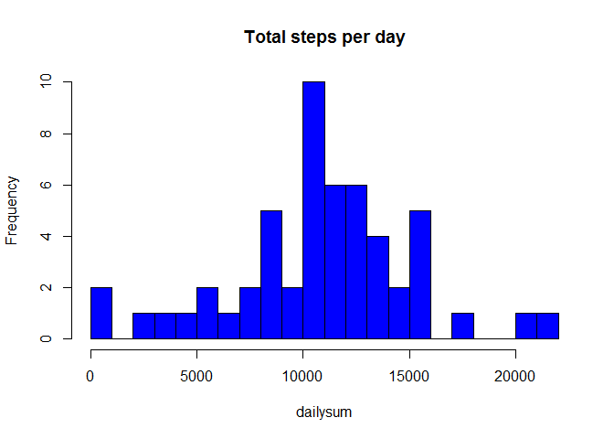
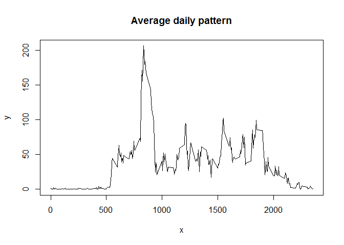
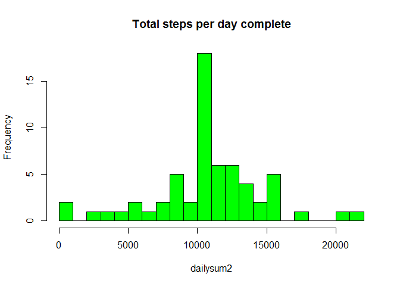

# Reproducible Research: Peer Assessment 1
lsbillups  


## Loading and preprocessing the data

First of all, let's load the data into R and take a look at the features of the given dataset.

```r
monitordata<-read.csv("activity.csv",colClasses = c("numeric","character","numeric"))
summary(monitordata)
```

```
##      steps            date              interval     
##  Min.   :  0.00   Length:17568       Min.   :   0.0  
##  1st Qu.:  0.00   Class :character   1st Qu.: 588.8  
##  Median :  0.00   Mode  :character   Median :1177.5  
##  Mean   : 37.38                      Mean   :1177.5  
##  3rd Qu.: 12.00                      3rd Qu.:1766.2  
##  Max.   :806.00                      Max.   :2355.0  
##  NA's   :2304
```

```r
head(monitordata)
```

```
##   steps       date interval
## 1    NA 2012-10-01        0
## 2    NA 2012-10-01        5
## 3    NA 2012-10-01       10
## 4    NA 2012-10-01       15
## 5    NA 2012-10-01       20
## 6    NA 2012-10-01       25
```

As we can see from the summary, there're quite a lot of missing values in the "steps" column, we are going to deal with this issue later. For now, we can just keep the class of "date" column as character.

## What is mean total number of steps taken per day?

```r
#split the dataset by date and sum them up
dailysteps<-split(monitordata$steps,monitordata$date)
dailysum<-sapply(dailysteps,sum)

#get rid of the missing values
dailysum<-dailysum[!is.na(dailysum)]

hist(dailysum,breaks=20,col="blue",main="Total steps per day")
```

 

```r
mean(dailysum)
```

```
## [1] 10766.19
```

```r
median(dailysum)
```

```
## [1] 10765
```
By making a histogram and take the mean and median, we obtain a general idea about the total number of step taken per day.

## What is the average daily activity pattern?

```r
#get rid of the missing values
monitornona<-monitordata[!(is.na(monitordata$steps)),]

#split the dataset by interval and take the mean
dailyinterval<-split(monitornona$steps,monitornona$interval)
intervalmean<-lapply(dailyinterval,mean)

x<-as.numeric(names(intervalmean))
y<-sapply(dailyinterval,mean)
plot(x,y,type="l",main="Average daily pattern")
```

 

```r
#find out which interval has the maximum mean
names(intervalmean)[which.max(intervalmean)]
```

```
## [1] "835"
```

## Imputing missing values

```r
#report the total number of missing values in the dataset
sum(is.na(monitordata$steps))
```

```
## [1] 2304
```

```r
#fill in the missing values by the mean steps over intervals 
monitordatafill<-monitordata
for (i in 1:length(monitordatafill$steps)){
    if (is.na(monitordatafill$steps[i])){
        interindex<-as.character(monitordatafill$interval[i])
        monitordatafill$steps[i]<-intervalmean[interindex]
    }
}
monitordatafill$steps<-as.numeric(monitordatafill$steps)

dailysteps2<-split(monitordatafill$steps,monitordatafill$date)
dailysum2<-sapply(dailysteps2,sum)

hist(dailysum2,breaks=20,col="green",main="Total steps per day complete")
```

 

```r
mean(dailysum2)
```

```
## [1] 10766.19
```

```r
median(dailysum2)
```

```
## [1] 10766.19
```
By comparing the histogram with and without missing values filling in, we fail to see any significant difference. Meanwhile, the mean and the median with the missing values filling in suggest the same result. Only the median changes a little bit.

## Are there differences in activity patterns between weekdays and weekends?


```r
#tranform the class of the "date" column into date class
monitordatafill$date<-as.Date(monitordatafill$date)

monitordatafill$weekdays<-weekdays(monitordatafill$date)
for (i in 1:nrow(monitordatafill)){
    if (monitordatafill$weekdays[i] == "Saturday"){
        monitordatafill$weekdays[i]<-"Weekend"
        }
    else if(monitordatafill$weekdays[i] == "Sunday"){
        monitordatafill$weekdays[i]<-"Weekend"
    }
    else{
        monitordatafill$weekdays[i]<-"Weekday"
    }
}

library(lattice)
monitordatafill<-transform(monitordatafill,weekdays = factor(weekdays),interval=as.numeric(interval))

meanstepsinterval<-aggregate(steps~interval+weekdays,data=monitordatafill,FUN = mean)
xyplot(steps~interval | weekdays, data= meanstepsinterval,layout=c(1,2),type="l")
```

 

There seems to be some differnce between weekdays and weekends in activity patterns. mean steps taken during the weekend seems more than during the weedays, however the maximum steps taken during the weedays seems larger.

